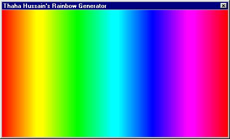

<div align="center">

## A   Rainbow Generator


</div>

### Description

It is an extremly simple Rainbow Generator - the code which was always asked by the viewers. See how a rainbow is generated with the varaitions in the values of primary colors - Red, Green and Blue. No API's used. Interesting and Full of Fun! Easy even for beginners!
 
### More Info
 


<span>             |<span>
---                |---
**Submitted On**   |
**By**             |[K\. O\. Thaha Hussain](https://github.com/Planet-Source-Code/PSCIndex/blob/master/ByAuthor/k-o-thaha-hussain.md)
**Level**          |Intermediate
**User Rating**    |3.8 (23 globes from 6 users)
**Compatibility**  |VB 5\.0, VB 6\.0
**Category**       |[Graphics](https://github.com/Planet-Source-Code/PSCIndex/blob/master/ByCategory/graphics__1-46.md)
**World**          |[Visual Basic](https://github.com/Planet-Source-Code/PSCIndex/blob/master/ByWorld/visual-basic.md)
**Archive File**   |[](https://github.com/Planet-Source-Code/k-o-thaha-hussain-a-rainbow-generator__1-22462/archive/master.zip)


### Source Code

```
'(C)2001 K. O. Thaha Hussain. India
' Analyst Programmer
' All Rights Reserved
' URL : www.bcity.com/thahahussain
' Company : www.induswareonline.com
Option Explicit
Private Sub Form_Load()
Me.AutoRedraw = True
Me.ScaleMode = vbTwips
Me.Caption = "Rainbow Generator by " & _
   "K. O. Thaha Hussain"
MsgBox "Resize the window to resize the Rainbow", , _
  "Thaha Hussain's Rainbow Generator"
End Sub
Private Sub Form_Resize()
Call Rainbow
End Sub
Private Sub Rainbow()
On Error Resume Next
Dim Position As Integer, Red As Integer, Green As _
    Integer, Blue As Integer
Dim ScaleFactor As Double, Length As Integer
ScaleFactor = Me.ScaleWidth / (255 * 6)
Length = Int(ScaleFactor * 255)
Position = 0
Red = 255
Blue = 1
'Purposfully avoided nested loops
 '------------- 1
 For Green = 1 To Length
 Me.Line (Position, 0)-(Position, Me.ScaleHeight), _
   RGB(Red, Green \ ScaleFactor, Blue)
 Position = Position + 1
 Next Green
'--------------- 2
For Red = Length To 1 Step -1
 Me.Line (Position, 0)-(Position, Me.ScaleHeight), _
   RGB(Red \ ScaleFactor, Green, Blue)
 Position = Position + 1
 Next Red
'---------------- 3
For Blue = 0 To Length
 Me.Line (Position, 0)-(Position, Me.ScaleHeight), _
   RGB(Red, Green, Blue \ ScaleFactor)
 Position = Position + 1
 Next Blue
 '----------------- 4
For Green = Length To 1 Step -1
 Me.Line (Position, 0)-(Position, Me.ScaleHeight), _
   RGB(Red, Green \ ScaleFactor, Blue)
 Position = Position + 1
 Next Green
 '------------------ 5
 For Red = 1 To Length
 Me.Line (Position, 0)-(Position, Me.ScaleHeight), _
   RGB(Red \ ScaleFactor, Green, Blue)
 Position = Position + 1
 Next Red
'------------------- 6
For Blue = Length To 1 Step -1
 Me.Line (Position, 0)-(Position, Me.ScaleHeight), _
   RGB(Red, Green, Blue \ ScaleFactor)
 Position = Position + 1
 Next Blue
End Sub
```

